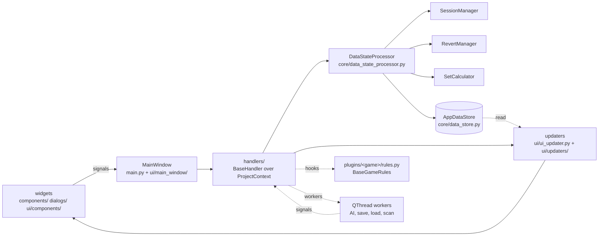

# Architecture

Picoripi is a PyQt6 desktop editor. One window, one data store, game-specific behaviour behind plugin hooks.
This page is the map; the wiki explains behaviour, the code is the authority.

## Data flow

1. A widget emits a signal; `MainWindow` routes it to a handler. `MainWindow` orchestrates and owns no logic.
2. A handler (`handlers/base_handler.py`) sees the application through `ProjectContext` (`core/context.py`).
3. Every change of text goes through `DataStateProcessor`: it writes `AppDataStore`, records undo, marks the
   block unsaved, autosaves the session. Nothing else mutates the store.
4. The handler asks an updater to refresh what shows the data. Updaters read the store and never write it.
5. Anything game-specific is a hook on `BaseGameRules` (`plugins/base_game_rules.py`), called through
   `core/plugin_call.py` on hot paths. The host imports no game plugin.
6. Slow work (disk, network, AI, archives) runs in a `WorkerThread` (`utils/thread_utils.py`) and reports by signal.

## Layers

| Package | Role | Start reading at | Tests | Doc |
|---|---|---|---|---|
| `main.py`, `ui/main_window/` | window, menus, routing | `main.py` | `tests/test_ui/test_main_window/` | wiki 1 |
| `handlers/` | one handler per feature area | `handlers/base_handler.py` | `tests/test_handlers/` | wiki 2 |
| `handlers/translation/` | AI runs: prompts, worker, results | `handlers/translation/facade/handler.py` | `tests/test_handlers/test_translation/` | wiki 11 |
| `core/data_processor/` | save, session, revert, queries | `core/data_state_processor.py` | `tests/test_core/` | this page |
| `core/glossary/` | glossary store, matching, sync ids | `core/glossary/manager.py` | `tests/test_core/` | wiki 8 |
| `core/glossary_build/` | glossary pipeline, Qt-free | `core/glossary_build/pipeline_coordinator.py` | `tests/test_core/` | wiki 8 |
| `core/translation/` | providers, transport, memory, layout contract | `core/translation/providers.py` | `tests/test_core/test_translation/` | wiki 11 |
| `core/project/` | `.uiproj` project, blocks, folders | `core/project/manager.py` | `tests/test_core/` | wiki 4 |
| `core/script_markup/` | walkthrough script model, Qt-free | `core/script_markup/__init__.py` | `tests/test_core/` | wiki 9 |
| `core/mempalace/` | story context database and workers | `core/mempalace_client.py` | `tests/test_core/` | `docs/MEMPALACE_CONTEXT_MANIFESTO.md` |
| `core/containers/` | game archives (RARC, U8, Yaz0) | `core/containers/container_manager.py` | `tests/test_core/` | wiki 3 |
| `core/settings/` | global, plugin and session settings | `core/settings_manager.py` | `tests/test_core/test_settings/` | wiki 4 |
| `ui/updaters/` | block tree, preview, text views, status | `ui/ui_updater.py` | `tests/test_ui/test_updaters/` | wiki 6 |
| `ui/settings/` | Settings dialog tabs | `ui/settings_dialog.py` | `tests/test_ui/test_settings/` | wiki 4 |
| `components/`, `dialogs/` | reusable widgets and dialogs | `components/editor/line_edit/` | `tests/test_components/`, `tests/test_dialogs/` | wiki 1 |
| `plugins/` | game rules, tag logic, problem rules | `plugins/spec.py` | `tests/test_plugins/` | wiki 3, `docs/PLUGIN_CONTRACT.md` |
| `utils/` | logging, threads, atomic files, width | `utils/thread_utils.py` | `tests/test_utils/` | this page |
| `companion/` | Companion server (separate process) | `companion/server/api.py` | `tests/test_companion/` | wiki 12 |

## Compatibility modules are not the implementation

These files only re-export names so that old imports keep working. Opening them shows almost nothing; the code
is in the package named beside each.

| Old module | Implementation |
|---|---|
| `core/glossary_manager.py` | `core/glossary/` |
| `core/project_manager.py` | `core/project/` |
| `core/mempalace_worker.py` | `core/mempalace/` |
| `handlers/translation_handler.py` | `handlers/translation/facade/` |
| `handlers/translation/glossary_handler.py` | `handlers/translation/glossary/` |
| `handlers/translation/ai_worker.py` | `handlers/translation/worker/` |
| `handlers/translation/ai_prompt_composer.py` | `handlers/translation/prompt_composer/` |
| `handlers/project_action_handler.py` | `handlers/project_action/` |
| `handlers/text_operation_handler.py` | `handlers/text_operation/` |
| `handlers/list_selection_handler.py` | `handlers/list_selection/` |
| `ui/main_window/main_window_actions.py` | `ui/main_window/actions/` |
| `ui/mempalace_builder_dialog.py` | `ui/mempalace/` |
| `ui/script_markup_studio_dialog.py` | `ui/script_markup/` |
| `components/editor/line_numbered_text_edit.py` | `components/editor/line_edit/` |

A test patches a name in the module that uses it, never in the compatibility module.

## Where to change what

| To change | Edit | Mind |
|---|---|---|
| How an edit is stored, undone, saved | `core/data_processor/`, `core/undo_manager.py` | all writes through `utils/atomic_io.py` |
| A file format a game uses | the plugin's `get_file_formats()`; the host side is `core/formats.py` | no extension checks in the host |
| A check or auto-fix on text | `plugins/common/problem_rules/` or the plugin | ids come from the plugin's problem definitions |
| Tag syntax of a game | the plugin's tag manager (`plugins/common/tag_manager.py`) | `plugins/common/tag_logic.py` is shared |
| What the model is told (batch) | `handlers/translation/prompt_composer/batch_mixin.py` | fixed rules live in `handlers/translation/prompt_composer/instructions.py`: cache-stable |
| What the model is told (one string) | `handlers/translation/prompt_composer/messages_mixin.py` | same |
| How requests are cut, retried, applied | `handlers/translation/worker/run_mixin.py`, `handlers/translation/batch_translator.py` | chunk plan must survive a resume |
| Network errors, retries, backoff | `core/translation/transport.py` | every provider goes through it |
| Glossary build stages | `core/glossary_build/` | Qt-free; the Qt worker is `handlers/translation/glossary_pipeline_worker.py` |
| The block tree | `ui/updaters/block_list/` | never query a database while painting |
| A Settings tab | `ui/settings/`, then `core/settings/` | defaults in `core/translation/config.py` for AI |
| A plugin hook | `plugins/base_game_rules.py` + `plugins/spec.py` | regenerate `docs/PLUGIN_CONTRACT.md` |
| An interface string | `tr("English")` + `locales/uk.json` | `core/i18n.py` |
| A background task | subclass `WorkerThread`; stop with `safe_shutdown_thread` | never `terminate()`, never block the UI thread |

## Cross-cutting rules in code

- **Headless mode.** `utils/app_mode.py` (`headless`) is the only switch for "no event loop, nobody at the
  screen"; `tests/conftest.py` sets it. Product code never detects the test runner.
- **Threads.** A worker emits its result from inside `run()`; `WorkerThread` keeps itself alive until Qt reports
  it finished, so a slot may drop its reference. A thread that would not stop is parked, never destroyed.
- **Files.** User data is written to a temporary file and renamed (`utils/atomic_io.py`).
- **Plugins.** Opt-in hooks; a missing hook means the feature is absent, not an error. `python -m plugins.validate`
  checks a plugin against `plugins/spec.py`.
- **Tests** mirror the packages under `tests/`; `tests/test_architecture/` holds the rules above as tests.
