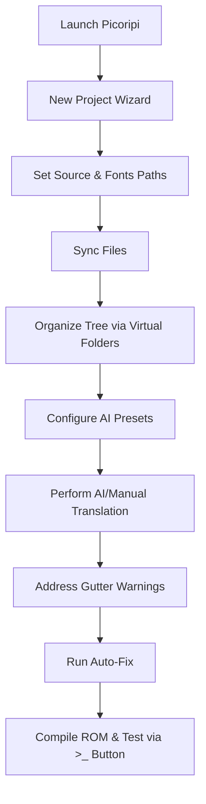

# User Guide and Workflow Pipeline

This document is a comprehensive user manual for the **Picoripi** visual translation workbench. It explains the user interface, keyboard shortcuts, localization pipeline steps, AI integration capabilities, and layout-troubleshooting features.

---

## 1. Interface Anatomy & UI Components

The Picoripi graphical user interface is divided into functional zones designed to streamline the translation and layout-validation workflow.

```
+---------------------------------------------------------------------------------+
|                                  Menu Bar                                       |
+---------------------------------------------------------------------------------+
|                                 Tool Bar                                        |
+---------------------------------------------------------------------------------+
| Project Tree    | Text Editors Panel (Original vs translation) | String Settings |
| (Left)          | +------------------------------------------+ | (Right)         |
|                 | | Original Text Area (Read-Only)           | |                 |
|                 | +------------------------------------------+ | Font Select     |
|                 | | Translation Text Area (Editable)         | | Width Override |
|                 | +------------------------------------------+ | Metadata View   |
|                 |                                              |                 |
|                 | Preview & Issues Panel (Bottom)              |                 |
|                 | +------------------------------------------+ |                 |
|                 | | Strings/Layout Preview & Warnings Gutter  | |                 |
|                 | +------------------------------------------+ |                 |
+-----------------+----------------------------------------------+-----------------+
|                                 Status Bar                                      |
+---------------------------------------------------------------------------------+
```

### 1.1 Main Menu Bar
*   **File Menu**:
    *   `New Project`: Starts the Project Creation Wizard to set up a new `.uiproj` workspace.
    *   `Open Project`: Loads an existing `.uiproj` file.
    *   `Save Project`: Instantly commits in-memory edits to disk.
    *   `Close Project`: Cleans up active states, handles caches, and returns to the initial state.
*   **Edit Menu**:
    *   `Undo / Redo`: Navigates back and forth through the text edit history.
    *   `Revert Selected String`: Reverts the currently focused dialogue string back to its original state.
    *   `Revert Block to Original`: Reverts the entire selected file block back to its original state.
*   **Translation Menu**:
    *   `Translate Line via AI`: Calls the active LLM to translate the highlighted row.
    *   `AI Translation Variations`: Opens the modeless Variations view.
    *   `Discuss with AI`: Opens the context-aware chat assistant dialogue.
*   **Tools Menu**:
    *   `Glossary Manager`: Opens the tabbed glossary manager dialog.
    *   `Global Issue Scan`: Initiates a project-wide scan of tag syntax and width issues.
    *   `Spellcheck Dictionary Manager`: Manages custom spellchecking dictionaries.
    *   `Run Build Script`: Executes the configured compilation tool/ROM compiler.
*   **Settings Menu**:
    *   `Preferences`: Opens the main global settings panel.

### 1.2 Interactive Toolbar Actions
*   📂 **Open/New Project**: Fast shortcuts for project management.
*   💾 **Save**: Instantly saves changes without showing blocker dialogs. Triggers a black, semi-transparent **Toast Notification** in the bottom-left corner.
*   ↩️/↪️ **Undo & Redo**: Standard history navigation.
*   🤖 **Translate Line**: Triggers AI translation for the focused row.
*   🎭 **AI Variations**: Generates up to 10 translation variants.
*   ⚡ **Auto-Fix**: Automatically word-wraps, cleans spaces, and formats tags for the current block.
*   🔍 **Search Bar**: Project-wide fuzzy search matching with punctuation-insensitive search logic.
*   📖 **Glossary**: Opens the glossary manager.
*   ⚙️ **Settings**: Opens the settings dialog.
*   ▶️ **Run External Script (`>_`)**: Spawns ROM builds, packers, or emulators asynchronously in a detached console window.

### 1.3 Project Tree (Left Panel)
*   **Virtual Folders**: Organize raw files into chapters or categories. These folders are virtual and do not modify the actual directories on disk.
*   **Asterisk Propagation (`*`)**: Unsaved changes in dialogue strings propagate an asterisk next to the file name and up the parent folders (e.g. `Folder* -> Subfolder* -> file.json*`).
*   **Progress Bars**: Semi-transparent green bars render left-to-right beneath file names, representing the completion percentage of non-empty translatable strings. Empty lines and tag-only codes are ignored to prevent false completion metrics.

### 1.4 Text Editors & Preview Panels (Center Panel)
*   **Original Pane (Read-Only)**: Displays the source text. Words that match glossary terms are underlined. Hovering over them shows their definition in a tooltip.
*   **Translation Pane (Editable)**: Where translations are entered. Contains line numbers, syntax highlighting for tags, and a vertical guideline showing where text exceeds the warning limit.
*   **Smart Empty Lines Hiding**: If a block contains 3 or more consecutive empty lines, the read-only preview panel condenses them into a single line showing `[start-end] X empty line(s)` to save screen space. Double-clicking this line number scrolls the editor to that string.
*   **Preview & Issues Panel**: Shows a rendered preview of the final text layout and details warning markers in the gutter.

### 1.5 String Settings Panel (Right Panel)
*   **Font Selection Combo Box**: Assigns a custom font override to the active line. Renders a soft purple background when an override is active.
*   **Width SpinBox**: Sets a custom pixel width threshold for the focused line. Renders a soft purple background and border when active.
*   **Metadata View**: Displays BMG IDs, file paths, and AI model translation metadata.

---

## 2. Power-User Hotkeys & Modifier Shortcuts

Picoripi contains advanced modifiers that alter standard toolbar and mouse actions:

| Trigger Action | Hotkey / Modifier | Outcome / Behavior |
| :--- | :--- | :--- |
| **Silent Save** | `Ctrl + S` | Instantly commits edits and triggers a bottom-left Toast notification. |
| **Block Navigation** | `Ctrl + PageUp / PageDown` | Cycles focus through files in the Project Tree. |
| **Zoom Workspace** | `Ctrl + Mouse Wheel` | Scales font sizes across the editors, tree, and preview. |
| **Selective Auto-Fix** | `Ctrl + Click on Auto-Fix` | Opens the **Selective Auto-Fix Dialog** to toggle specific rules (e.g. toggle icon spacing, page margins, empty lines). |
| **Page-Local Auto-Fix** | `Shift + Click on Auto-Fix` | Runs Auto-Fix only on the active page, keeping page counts intact. |
| **Prompt Editor** | `Ctrl + Click on Translate` | Opens the **Prompt Editor Dialog** to adjust the system instructions for this run. |
| **AI Variation Modifiers** | `Ctrl + Click on AI Variations` | Opens a prompt field to append instructions (e.g., "make it more formal"). |
| **Glossary Navigation** | `Ctrl + Click on Glossary Word` | Opens the Glossary Manager focused on the clicked term. |
| **Curly Tag Replacements** | `Ctrl + Click on Bracketed Tag` | Replaces a bracket tag (e.g., `[PLAYER]`) with a curly tag from the clipboard (e.g. `{PLAYER}`). |

---

## 3. Step-by-Step Translation Pipeline

This section details a standard translation workflow:



### Step 1: Create a Project Workspace
1.  Go to **File -> New Project** (`Ctrl+N`).
2.  In the Project Wizard, set a **Project Name** and choose a game plugin (e.g., `zelda_mc` for Zelda Minish Cap, or `plain_text`).
3.  Choose a **Source Directory** (where your raw BMG/JSON files are stored).
4.  Choose a **Fonts Directory** (for custom Nintendo `.bfn` files or `.json` font maps).
5.  Click Create. The system scans the directory, extracts archive members in memory (no disk clutter), and populates the Project Tree.

### Step 2: Organize the Narrative Tree
1.  Right-click any folder in the Project Tree and select **Create Category**.
2.  Name the category (e.g., `Chapter_1_Intro`).
3.  Drag and drop files to organize them logically.
4.  Right-click a file and select **Rename** to change its display label.

### Step 3: Configure AI Presets
1.  Go to **Tools -> Settings** and select the **AI Translation** tab.
2.  Select a provider (e.g., Gemini).
3.  Enter your **API Key** and select a model (e.g. `gemini-1.5-pro-latest`).
4.  Set a custom **Temperature** (lower values like `0.3` are recommended for consistent translations).
5.  Click **Save Preset** and give it a name. You can save multiple presets (e.g., a local Ollama preset and a Gemini preset) and switch between them instantly.

### Step 4: Translating Dialogue
*   **Manual**: Click a line in the preview panel and start typing in the Translation Editor.
*   **AI Translation**:
    1.  Select a line or highlight multiple lines in the preview panel.
    2.  Click **Translate** on the toolbar.
    3.  The system identifies the active line's indices and injects up to 3 preceding and 3 succeeding lines as context. This ensures that pronouns, Slavic gender endings, and formal/informal verb inflections remain consistent.
    4.  The system checks the glossary, extracts terms found in the source text, and injects only those terms into the LLM prompt.
    5.  It replaces complex inline tags with human word equivalents using the **Force-Alias (`F:`)** prefix (e.g., `{escape:0:0022}` becomes `{F:Buddy}`). This prevents the LLM from corrupting the tag syntax. Post-translation, it restores the original tags.

---

## 4. Under the Hood: Word Wrapping & Layout Algorithms

Picoripi's layout calculation engine ensures that text fits within target UI bounds.

### 4.1 Proportional Width Calculation
Traditional word processors wrap text based on character counts. Picoripi wraps text based on **pixel width**:

$$\text{Total Line Width (px)} = \sum_{c \in \text{characters}} \text{Width}(c) + \text{Width}(\text{Tags}) + \text{Kerning}$$

*   **Character Widths**: Retrieved from `font_map.json` (Unicode decimal keys).
*   **Tags and Aliases**: If the editor encounters a tag alias like `{PLAYER}`, it queries the font map and substitutes the alias's width (e.g., 24px).
*   **Guideline Tickers**: A vertical guideline in the text editor scales to match these measurements, updating in real time as you type.

### 4.2 Proportional Word Wrapping
When wrapping text, the formatting engine uses a lookahead algorithm:
1.  It sums the widths of words sequentially.
2.  If adding the next word exceeds `line_width_warning_threshold_pixels`, it splits the line.
3.  **Exception**: If a single word is wider than the threshold, but the line's total width is less than the hard limit (`game_dialog_max_width_pixels`), the word is allowed to remain without splitting. This prevents premature wrapping splits.

### 4.3 Sentence-Integrity Pagination
Dialogue screens are segmented into multi-page text boxes. Picoripi groups pages using breaks like `\p` or `\l`:
*   **Sentence Preservation**: The pagination engine tries to keep sentences together on a single page. If adding the next sentence exceeds the page line limit (e.g., 4 lines), the entire sentence is pushed to the next page.
*   **Page-Local Auto-Fix (`Shift+AutoFix`)**: Fixes layout issues on the active page only, without pushing text onto subsequent pages. This preserves page boundaries.

### 4.4 Lookahead Preposition Rules
In Slavic languages (like Ukrainian) and some others, single-letter prepositions (e.g. "в", "й", "і", "а", "з", "у") should not sit isolated at the end of a line.
*   **Lookahead rule**: If the lookahead parser identifies that a single-character word is positioned at the end of a line, it checks if both the preposition and the word following it can fit together on the current line.
*   **Behavior**: If they do not fit, both the preposition and the following word are pushed to the next line together. This avoids orphaned prepositions.

---

## 5. Troubleshooting Common Layout Issues

Here is how to resolve typical warnings highlighted in the gutter:

### Red Gutter: Pixel Width Exceeded (`ZWW_WIDTH_EXCEEDED`)
*   **Cause**: The translated text line exceeds the pixel boundary of the dialogue box.
*   **Fix**: Click **Auto-Fix** to automatically wrap the text using proportional width parameters. If it still overflows, rephrase the translation or shorten the words.

### Green Gutter: Short Line (`ZWW_SHORT_LINE`)
*   **Cause**: Words from the next line can fit onto the current line.
*   **Fix**: Run **Auto-Fix** to pull words up and balance the line layout.

### Light Gray Gutter: Malformed or Mismatched Tag (`ZWW_TAG_WARNING`)
*   **Cause**: A control tag is missing a closing brace (e.g. `{Color:Red` or `[PLAYER`), or the translated text has a mismatch in tag count or tag names compared to the original (excluding exceptions like `Link` and `Epona` case-insensitively).
*   **Fix**: Inspect the tags and ensure they match the original text. You can also run **Auto-Fix** to clean up tag syntaxes automatically.

### Light Blue Gutter: Missing Tag Spacing (`ZWW_MISSING_ICON_SPACING`)
*   **Cause**: A button icon tag (e.g., `[(A)]`) is directly merged with text characters (e.g., `Press[(A)]to`), or two words are separated by zero-width tags (e.g., `word1{color:red}word2`) without any space.
*   **Fix**: Auto-Fix automatically inserts spaces (e.g., `Press [(A)] to` or `word1 {color:red}word2`). The parser ignores adjacent punctuation like periods or commas, and treats hyphens immediately after the icon (e.g. `{(L)}-наведення`) as an exception where no space is required. Spacing before the hyphen in such constructs is treated as an error and automatically stripped. For zero-width tags, a space is required if they are situated directly between two alphanumeric characters of adjacent words.

### Purple Gutter: Broken Icon-Hyphen Wrap (`ZWW_BROKEN_ICON_HYPHEN`)
*   **Cause**: A tag-hyphen-word construct (e.g., `{(L)}-наведення`) is broken across a line break.
*   **Fix**: The word wrap engine treats these constructs as single entities to prevent automatic splitting. If split manually, rephrase or adjust line breaks to keep the construct on the same line.

