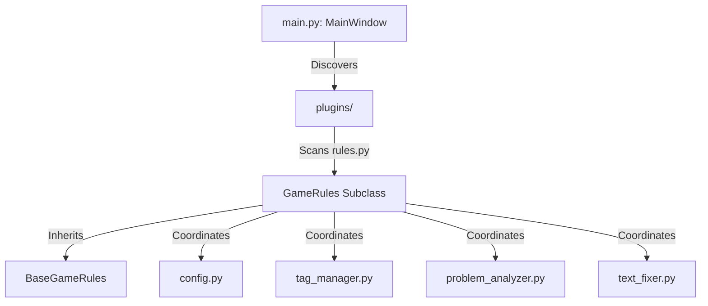

# Plugin Developer Guide (with AI Prompts)

This document provides technical guidelines on how the Picoripi plugin architecture functions and details how to build new game-specific plugins. It includes a copy-pasteable prompt designed to instruct AI models (like Gemini, ChatGPT, Claude) to build fully functional plugins.

---

## 1. Architectural Overview & Hook System

Picoripi discovers plugins dynamically by scanning the directories inside `plugins/`. Any directory that contains a `rules.py` containing a subclass of `BaseGameRules` (`plugins/base_game_rules.py`) is registered as a plugin.



### 1.1 Core Inheritance Hooks
A custom plugin must override methods in `BaseGameRules` to define its layout rules, formatting, and file parsers.

*   `load_data_from_json_obj(self, json_data: Any) -> Tuple[List[List[str]], Dict[int, str]]`: Decodes the raw file format loaded from disk into the internal lists of string arrays (pages/blocks of dialogues) and block name mappings.
*   `save_data_to_json_obj(self, data: List[List[str]], block_names: Dict[int, str]) -> Any`: Encodes the modified dialogue lists back into the raw file format for writing to disk.
*   `get_display_name(self) -> str`: Return a user-friendly plugin name shown in settings.
*   `get_problem_definitions(self) -> Dict[str, Dict[str, Any]]`: Returns a dictionary mapping problem IDs to names, descriptions, colors, and layout priority levels.
*   `get_legitimate_tags(self) -> Set[str]`: Returns a set of regular expression patterns or strings defining valid in-game control codes (e.g. `{Color:Red}`, `[PLAYER]`).
*   `get_syntax_highlighting_rules(self) -> List[Tuple[str, QTextCharFormat]]`: Defines the color/style patterns for text highlights in editors.
*   `analyze_subline(self, ...)`: Validates a single text line (computes widths, checks tags, spacings) and returns a set of active warning codes.
*   `autofix_data_string(self, ...)`: Automatically wraps, pads, and formats strings to resolve warnings.

---

## 2. Configuration & Default Metrics (`plain_text`)

The standard layout behavior is provided by the `plain_text` plugin. It serves as a benchmark for custom designs.

### 2.1 File Structure
A standard plugin directory contains:
```
plugins/my_plugin/
├── __init__.py
├── rules.py                 # Extends BaseGameRules
├── config.py                # Defines priority constants, colors, and problems
├── tag_manager.py           # Handles regex tag validation and syntax highlight styles
├── problem_analyzer.py      # Bounding checks, orphan prepositions, width calculation
├── text_fixer.py            # Line splitter, smart word wrapping, page padding logic
└── font_map.json            # Character pixel widths & gameplay tag aliases
```

### 2.2 Character Width Mapping (`font_map.json`)
The layout guideline uses proportional width calculations:
```json
{
  "widths": {
    "32": 4,
    "33": 2,
    "65": 7
  },
  "aliases": {
    "{PLAYER}": {
      "alias": "Link",
      "width": 24
    }
  },
  "default_width": 6
}
```
*   `widths`: A lookup where keys are decimal ASCII/Unicode code points, and values are pixel widths.
*   `aliases`: Defines pixel widths for specific game tags. If the tag name represents a pronoun or entity, prepend `F:` (e.g., `{F:Link}`) to allow the translation engine to handle Slavic declensions properly, swapping the real tag back in post-translation.

---

## 3. Copy-Paste AI Prompt for Generating New Plugins

When prompting an AI assistant to write a custom plugin for Picoripi, use the following detailed prompt. Copy it exactly and fill in the bracketed parts to get a fully working, robust implementation:

```text
You are an expert developer building a custom game plugin for the "Picoripi" visual translation workbench.
Picoripi is built using Python 3.14 and PyQt6.

I need you to generate a fully functioning game plugin named: [MY_GAME_PLUGIN_NAME].
This plugin must reside in a package directory 'plugins/[my_game_plugin_name]/'.

The plugin must implement:
1. 'config.py': Define warning code strings prefixed with '[PREFIX]_', priority integers, QColor objects, and the PROBLEM_DEFINITIONS dictionary.
2. 'tag_manager.py': Manage game-specific tags. Tag syntax for this game uses [DESCRIBE TAG FORMAT, e.g. <Tag:Value> or [tag_id]]. Specify regex patterns to match valid tags. Add syntax highlighting rules returning List[Tuple[str, QTextCharFormat]].
3. 'problem_analyzer.py': Must calculate pixel width using the provided 'editor_font_map'. Must identify the following warnings:
    - '[PREFIX]_TAG_WARNING' (Broken/unclosed tags).
    - '[PREFIX]_WIDTH_EXCEEDED' (Pixel width exceeding the configured threshold).
    - '[PREFIX]_SHORT_LINE' (Next line's words can fit on current line. Incorporate lookahead to prevent leaving a single-letter preposition hanging at the end of a line).
    - [ADD OTHER CUSTOM CHECKS IF ANY].
4. 'text_fixer.py': Implement 'autofix_data_string' that takes a raw dialogue string, parses its layout pages, wraps text using proportional character widths from 'editor_font_map' to fit under the pixel width threshold, cleans extra spaces, checks tag spacing, and returns the formatted text.
5. 'rules.py': Inherit from 'BaseGameRules' (imported from 'plugins.base_game_rules'). Map all methods to coordinate the components defined above:
    - 'load_data_from_json_obj(self, json_data)': Custom parser that takes raw loaded files and returns (data_list, block_names_dict).
    - 'save_data_to_json_obj(self, data, block_names)': Custom serializer back to disk format.
    - 'analyze_subline(...)': Delegates to problem_analyzer.
    - 'autofix_data_string(...)': Delegates to text_fixer.
    - 'get_editor_page_size(self)': Returns [NUMBER, e.g. 3 or 4] lines per page.
    - 'get_display_name(self)': Returns "[FRIENDLY_GAME_TITLE]".

Here are the specific details of the game format:
- File Format: [DESCRIBE FORMAT, e.g. JSON with a list of dictionaries containing 'id' and 'text', or plain text transcript]
- Special tags: [LIST TAGS, e.g. <COLOR:RED>, <PLAYER>, <PAGE_BREAK>]
- Text boundaries: Max pixel width is [MAX_WIDTH] pixels. Line count limit per dialog is [MAX_LINES] lines.

Please output the complete code for:
- 'config.py'
- 'tag_manager.py'
- 'problem_analyzer.py'
- 'text_fixer.py'
- 'rules.py'

Ensure the code is robust, imports PyQt6 modules correctly, uses BaseGameRules interfaces, and includes no placeholders.
```

Using this prompt ensures the AI generates components matching Picoripi's internal architectural interface, preventing integration issues.
